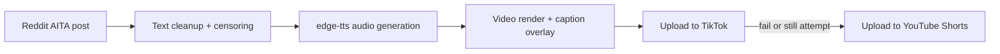

# TikTok + YouTube Shorts Bot

A complete pipeline that fetches top Reddit AITA posts, cleans and censors the
text, converts the story to TTS audio, renders a vertical video with captions,
and uploads it to TikTok — with YouTube Shorts as a fallback.

---

## What it does

- Fetches a trending post from `r/AITAH`
- Cleans and censors sensitive content
- Splits the story into TTS-ready chunks
- Converts text to audio with `edge-tts`
- Renders the video using `moviepy` and `Pillow`
- Uploads to TikTok using a browser session
- If TikTok upload fails, it still attempts a YouTube Shorts upload

---

## Architecture



---

## Prerequisites

### Python dependencies
Install the Python dependencies:

```bash
python -m pip install -r requirements.txt
```

### System dependencies
- **ImageMagick** must be installed and the binary path set in `config.py`
- **Chrome** must be installed for TikTok upload
- **ChromeDriver** must be installed and the path configured in `config.py`

If Chrome and ChromeDriver major versions differ, download a matching
ChromeDriver from https://chromedriver.chromium.org/downloads.

---

## Configuration

### `config.py`
Edit `config.py` with your local paths, credentials files, and upload settings. Keep the values aligned with your Windows environment and the files you plan to use.

Example template:

```python
BACKGROUND_VIDEO = r"C:\path\to\background.mp4"
OUTPUT_VIDEO = r"C:\path\to\output.mp4"
IMAGEMAGICK_PATH = r"C:\Program Files\ImageMagick\magick.exe"
CHROME_PROFILE_DIR = r"C:\path\to\chrome_profile"
CHROMEDRIVER_PATH = r"C:\path\to\chromedriver.exe"

REDDIT_CREDS_FILE = "redditcreds.txt"
TIKTOK_COOKIES_FILE = "tiktok_cookies.txt"
YOUTUBE_CLIENT_SECRETS_FILE = "youtube_client_secret.json"
YOUTUBE_TOKEN_FILE = "youtube_token.json"
```

Other options in `config.py` can remain at their defaults unless you want to customize voice, video layout, or upload details.

---

## Setup

### 1. Create a Python environment

```bash
python -m venv .venv
.venv\Scripts\activate
python -m pip install -r requirements.txt
```

### 2. Install ImageMagick

Install ImageMagick and set `IMAGEMAGICK_PATH` in `config.py` to the `magick.exe` path.

### 3. Configure Reddit credentials

Create `redditcreds.txt` with either format:

Preferred:
```ini
client_id=YOUR_CLIENT_ID
client_secret=YOUR_CLIENT_SECRET
username=YOUR_REDDIT_USERNAME
password=YOUR_REDDIT_PASSWORD
user_agent=tiktokbot/1.0
```

Legacy:
```ini
id=YOUR_CLIENT_ID
secret=YOUR_CLIENT_SECRET
user=YOUR_REDDIT_USERNAME
pass=YOUR_REDDIT_PASSWORD
agent=tiktokbot/1.0
```

Create a Reddit "script" app at https://www.reddit.com/prefs/apps.

### 4. Configure TikTok upload

This repo uses browser automation for TikTok upload.

- Save TikTok cookies in Netscape format as `tiktok_cookies.txt`
- Use a browser extension like "Get cookies.txt"
- Make sure the cookies file is in the project root

### 5. Configure YouTube upload

If you want YouTube Shorts support, add:
- `youtube_client_secret.json` in the project root
- `google-api-python-client`, `google-auth`, `google-auth-oauthlib`, and `google-auth-httplib2` are already in `requirements.txt`

Then run the first auth flow via the script by uploading once.

---

## Usage

### Full TikTok + YouTube pipeline

```bash
python main.py
```

### Render video only

```bash
python main.py --render
```

### Upload existing rendered video to TikTok only

```bash
python main.py --upload
```

### Upload existing rendered video to YouTube only

```bash
python main.py --upload --youtube
```

### Login to TikTok manually

```bash
python main.py --login
```

---

## Automation

### Windows Task Scheduler

Create a scheduled task that runs daily, for example:

```powershell
schtasks /Create /SC DAILY /TN "TikTokBotDaily" /TR "C:\Users\roryt\Desktop\Code\tiktokbot\claudetok\python.exe C:\Users\roryt\Desktop\Code\tiktokbot\claudetok\main.py" /ST 09:00
```

### Linux / macOS cron

```bash
0 9 * * * /path/to/python /path/to/main.py
```

This will trigger the full pipeline once per day.

---


## Core scripts

The main pipeline is organized into a small set of Python modules for configuration, Reddit ingestion, media rendering, and upload automation.

- `config.py` — runtime settings and paths
- `main.py` — orchestrator for render and upload modes
- `reddit.py` — Reddit fetch and text cleanup
- `videorender.py` — TTS and video creation
- `upload.py` — TikTok upload automation
- `youtube_auth.py` / `youtube_upload.py` — YouTube OAuth and upload support

---

## Important security notes

Never commit:
- `redditcreds.txt`
- `tiktok_cookies.txt`
- `youtube_client_secret.json`
- `youtube_token.json`
- any local profile or secret files

The provided `.gitignore` already excludes these files.

---

## Dependency summary

The pipeline depends on:
- `praw` — Reddit API
- `edge-tts` — Microsoft neural TTS
- `moviepy` — video rendering and compositing
- `Pillow` — caption image generation
- `selenium` + `undetected-chromedriver` — TikTok browser automation
- `tiktok-uploader` — TikTok scripting/upload support
- `google-api-python-client` + `google-auth*` — YouTube API upload

### System dependency
- ImageMagick CLI (`magick.exe`) must be installed and configured in `config.py`
